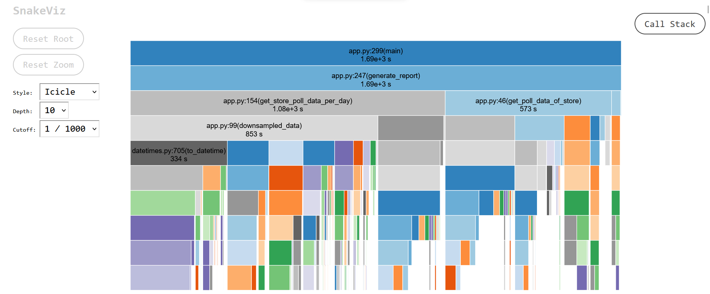

---
jupyter:
  kernelspec:
    display_name: .env
    language: python
    name: python3
  language_info:
    name: python
    version: 3.11.1
  nbformat: 4
  nbformat_minor: 2
  orig_nbformat: 4
  vscode:
    interpreter:
      hash: 54da821b4d047831e425637e002936bc266b46909ecf1563e95da673e0eb0b0c
---


``` python
from pymongo import MongoClient

client = MongoClient("mongodb://localhost:27017/")
db = client["local"]
store_status_coll = db["store_status"]
timezone_coll = db["restaurant_tz"]
menu_hours_coll = db["menu_hours"]
reports_coll = db["reports"]
```


``` python
from datetime import datetime
import pytz

def get_unique_store_ids_from_poll() -> list[str]:
    """
    Returns a list of unique store IDs from the "store_id" field in the store_status_coll collection.

    Returns:
        list[str]: A list of unique store IDs.
    """
    return store_status_coll.distinct("store_id")

def get_timezone_using_store_id(store_id: str) -> str:
    """
    Returns the timezone string for the given store ID from the timezone_coll collection,
    or "America/Chicago" if the store ID is not found.

    Args:
        store_id (str): The store ID to retrieve the timezone for.

    Returns:
        str: The timezone string for the given store ID, or "America/Chicago" if the store ID is not found.
    """
    result = timezone_coll.find_one({"store_id": store_id})
    return result["timezone_str"] if result else "America/Chicago"

def utc_to_local(utc_time_str: str, timezone_str: str) -> str:
    """
    Converts a UTC datetime string to a local datetime string in the specified timezone.

    Args:
        utc_time_str (str): A UTC datetime string in the format "%Y-%m-%d %H:%M:%S.%f UTC".
        timezone_str (str): A timezone string in the format "America/Chicago".

    Returns:
        str: A local datetime string in the format "%Y-%m-%d %H:%M:%S.%f".
    """
    utc_time = datetime.strptime(utc_time_str, "%Y-%m-%d %H:%M:%S.%f UTC")
    local_tz = pytz.timezone(timezone_str)
    local_time = utc_time.replace(tzinfo=pytz.utc).astimezone(local_tz)
    return local_time.strftime("%Y-%m-%d %H:%M:%S.%f")
```


``` python
from pymongo import ASCENDING

def get_poll_data_of_store(store_id: str):
    """
    Fetches poll data for a given store ID and returns it as a dictionary of lists,
    where each key represents a day of the week and each value is a list of poll
    data for that day.

    Args:
        store_id (str): The ID of the store to fetch poll data for.

    Returns:
        dict: A dictionary of lists, where each key represents a day of the week
        (0 for Monday, 6 for Sunday) and each value is a list of poll data for that day.
        Each poll data item is represented as a dictionary with the keys "timestamp_local"
        (a string representing the local time in the format "HH:MM:SS") and "status"
        (a boolean representing the status of the store at that time).
    """
    tz: str = get_timezone_using_store_id(store_id)

    result = store_status_coll.find(
        {"store_id": store_id},
        projection={"_id": False, "timestamp_utc": True, "status": True},
    )
    result.sort([("timestamp_utc", ASCENDING)])
    data = {"0": [], "1": [], "2": [], "3": [], "4": [], "5": [], "6": []}
    for doc in result:
        if (
            datetime.strptime(doc["timestamp_utc"], "%Y-%m-%d %H:%M:%S.%f UTC")
            > datetime.now()
        ):
            continue
        local_time = utc_to_local(doc["timestamp_utc"], tz)
        data[
            str(datetime.strptime(local_time, "%Y-%m-%d %H:%M:%S.%f").weekday())
        ].append(
            {
                "timestamp_local": datetime.strptime(
                    local_time, "%Y-%m-%d %H:%M:%S.%f"
                ).strftime("%H:%M:%S"),
                "status": 1 if doc["status"] == "active" else 0,
            }
        )
    return data
```


``` python
def filter_status_by_business_hours(day_status: list[dict], day_business_hours: list[dict]) -> list[dict]:
    """
    Filters the list of status entries for a particular day based on the business hours.

    Args:
        day_status (list[dict]): A list of status entries for the day, each containing the timestamp_local and status keys.
        day_business_hours (list[dict]): A list of business hours for the day, each containing the start_time_local and end_time_local keys.

    Returns:
        list[dict]: A list of status entries that fall within the business hours.
    """
    filtered_status = []
    for entry in day_status:
        timestamp = datetime.strptime(entry["timestamp_local"], "%H:%M:%S").time()
        for hours in day_business_hours:
            start_time = datetime.strptime(hours["start_time_local"], "%H:%M:%S").time()
            end_time = datetime.strptime(hours["end_time_local"], "%H:%M:%S").time()
            if start_time <= timestamp <= end_time:
                filtered_status.append(entry)
                break
    return filtered_status
```


``` python
import pandas as pd
def downsampled_data(data):
    """
    Downsamples time-series data to hourly intervals.

    Args:
        data: A list of dictionaries representing time-series data. Each dictionary
            should have the keys "timestamp_local" (a string representing a local
            timestamp in the format "HH:MM:SS") and "status" (a float representing a
            status value).

    Returns:
        A list of dictionaries representing the downsampled time-series data. Each
        dictionary has the keys "timestamp_local" (a string representing a local
        timestamp in the format "HH:MM:SS") and "status" (a string representing the
        mean status value for the corresponding hourly interval).
    """

    df = pd.DataFrame(data)
    if not data:
        return df

    df["timestamp_local"] = pd.to_datetime(df["timestamp_local"])
    df.set_index("timestamp_local", inplace=True)
    downsampled = df.resample("60T").mean()
    downsampled_data = [
        {"timestamp_local": ts.time().strftime("%H:%M:%S"), "status": status}
        for ts, status in zip(downsampled.index, downsampled["status"])
    ]
    return downsampled_data
```


``` python
def get_business_hours_of_store(store_id: str)-> dict[str, list[dict[str, str]]]:
    """
    Returns a dictionary of the business hours for each day of the week for a given store.

    Args:
        store_id (str): the ID of the store

    Returns:
        Dict[str, List[Dict[str, str]]]: a dictionary where each key represents a day of the week
        (0-6 for Monday to Sunday) and each value is a list of dictionaries containing the start and end times
        for each business hour period on that day in the format {"start_time_local": "HH:MM:SS", "end_time_local": "HH:MM:SS"}.
    """
    business_hours = {"0": [], "1": [], "2": [], "3": [], "4": [], "5": [], "6": []}

    for rec in menu_hours_coll.find({"store_id": store_id}):
        business_hours[rec["day"]].append(
                {
                    "start_time_local": rec["start_time_local"],
                    "end_time_local": rec["end_time_local"],
                }
            )

        # TODO: Can also interpolate the business hours of a particular day using the polling data.
    for day, hours in business_hours.items():
        if not hours:
            business_hours[day] = [
                    {
                        "start_time_local": "00:00:00",
                        "end_time_local": "23:59:59",
                    }
                ]
            
    return business_hours
```


``` python
def get_store_poll_data_per_day(store_poll_data, business_hours) -> dict[str, list]:
    """
    Given a dictionary of store poll data and a dictionary of business hours, returns a dictionary
    of downsampled and filtered store poll data, with one key-value pair for each day of the week.

    Parameters:
    - store_poll_data (dict): A dictionary of store poll data, with keys 0-6 representing days of the week,
    and values being lists of dictionaries with keys "timestamp_local" (a string representing the local timestamp)
    and "status" (a string representing the store's status).
    - business_hours (dict): A dictionary of business hours, with keys 0-6 representing days of the week,
    and values being lists of dictionaries with keys "start_time_local" (a string representing the local start time)
    and "end_time_local" (a string representing the local end time).

    Returns:
    - store_poll_data_per_day (dict): A dictionary of downsampled and filtered store poll data, with keys 0-6
    representing days of the week, and values being lists of dictionaries with keys "timestamp_local"
    (a string representing the local timestamp) and "status" (a string representing the store's status), 
    [0.0, 1.0] in factor of hours,
    """

    store_poll_data_per_day = {
        "0": [],
        "1": [],
        "2": [],
        "3": [],
        "4": [],
        "5": [],
        "6": [],
    }
    for day in range(0, 7):
        store_poll_data_per_day[str(day)] = filter_status_by_business_hours(
            store_poll_data[str(day)], business_hours[str(day)]
        )
        store_poll_data_per_day[str(day)] = sorted(
            store_poll_data_per_day[str(day)], key=lambda x: x["timestamp_local"]
        )
        store_poll_data_per_day[str(day)] = downsampled_data(
            store_poll_data_per_day[str(day)]
        )

    return store_poll_data_per_day
```


``` python
from datetime import timedelta
import math

def uptime_today(store_poll_data_per_day) -> tuple(float, float):
    """
    Calculates the uptime for the current day and the minutes of uptime for the last hour.

    Args:
    - store_poll_data_per_day: a dictionary containing the polling data for each day of the week.

    Returns:
    A tuple containing two floats:
    - hours_today: the number of hours of uptime for the current day.
    - minutes_last_hour: the number of minutes of uptime for the last hour.
    """

    last_weekday: int = datetime.now().weekday() - 1
    last_hour: str = (datetime.now() - timedelta(hours=1)).strftime("%H:00:00")

    hours_today: float = 0.0
    minutes_last_hour: float = 0.0

    for day_data in store_poll_data_per_day[str(last_weekday)]:
        hours_today += day_data["status"] if not math.isnan(day_data["status"]) else 0

        if day_data["timestamp_local"] == last_hour:
            minutes_last_hour = float(
                day_data["status"] * 60 if not math.isnan(day_data["status"]) else 0
            )

    return hours_today, minutes_last_hour


def uptime_hours_this_week(store_poll_data_per_day) -> float:
    """
    Calculates the total uptime hours for the current week based on the data in store_poll_data_per_day.

    Args:
    - store_poll_data_per_day: a dictionary containing the store poll data for each day of the week

    Returns:
    - hours_this_week: a float representing the total uptime hours for the current week
    """
    hours_this_week: float = 0.0
    for weekday in range(0, 7):
        for day_data in store_poll_data_per_day[str(weekday)]:
            hours_this_week += (
                day_data["status"] if not math.isnan(day_data["status"]) else 0
            )

    return hours_this_week
```


``` python
from typing import Any

def generate_report() -> list:
    """
    Generates a report for all stores based on their uptime/downtime statistics for the last hour, day, and week.

    Returns:
    A list of dictionaries, where each dictionary contains the following keys:
    - 'store_id': (str) The ID of the store.
    - 'uptime_last_hour': (float) The uptime of the store in minutes for the last hour.
    - 'downtime_last_hour': (float) The downtime of the store in minutes for the last hour.
    - 'uptime_last_day': (float) The uptime of the store in hours for the last day.
    - 'downtime_last_day': (float) The downtime of the store in hours for the last day.
    - 'uptime_last_week': (float) The uptime of the store in hours for the last week.
    - 'downtime_last_week': (float) The downtime of the store in hours for the last week.
    """
    result: list = []

    for store_id in get_unique_store_ids_from_poll():
        current_result: dict[str, Any] = {
            "store_id": store_id,
            "uptime_last_hour": 0.0,
            "downtime_last_hour": 60.0,
            "uptime_last_day": 0.0,
            "downtime_last_day": 24.0,
            "uptime_last_week": 0.0,
            "downtime_last_week": 168.0,
        }

        # [{'timestamp_local:"", 'status':""}]
        store_poll_data: dict[str, list] = get_poll_data_of_store(store_id)

        # {'day':[{'start_time_local':"", 'start_time_local':""}]}
        business_hours: dict[str, list] = get_business_hours_of_store(store_id)

        store_poll_data_per_day: dict[str, list] = get_store_poll_data_per_day(
            store_poll_data, business_hours
        )

        (hours_today, minutes_last_hour) = uptime_today(store_poll_data_per_day)

        hours_this_week: float = uptime_hours_this_week(store_poll_data_per_day)

        current_result["uptime_last_hour"] = minutes_last_hour
        current_result["uptime_last_day"] = hours_today
        current_result["uptime_last_week"] = hours_this_week
        current_result["downtime_last_hour"] = 60 - current_result["uptime_last_hour"]
        current_result["downtime_last_day"] = 24 - current_result["uptime_last_day"]
        current_result["downtime_last_week"] = 168 - current_result["uptime_last_week"]
        result.append(current_result)

    return result
```


-   Profiling data




-   API endpoints


``` python
from fastapi import FastAPI

app: FastAPI = FastAPI()
```


``` python
import uuid

from fastapi.responses import JSONResponse

@app.get("/trigger-report")
def trigger_report() -> JSONResponse:
    running_doc: Any | None = reports_coll.find_one(
        {"sentinel_id": 0, "status": "running"}
    )
    if running_doc:
        response_body: dict[str, str] = {
            "message": "Running",
            "report_id": running_doc["report_id"],
        }
        return JSONResponse(content=response_body, status_code=400)

    # Report generation
    report_id: str = str(uuid.uuid4())
    reports_coll.update_one(
        {"sentinel_id": 0, "status": "complete"},
        {
            "$set": {"status": "running", "report_id": report_id},
        },
    )

    report: list = generate_report()
    reports_coll.insert_one(
        {"report_id": report_id, "report": report, "report_status": "complete"}
    )
    response_body: dict[str, str] = {
        "message": "Complete",
        "report_id": report_id,
    }

    reports_coll.update_one({"sentinel_id": 0}, {"$set": {"status": "complete"}})

    return JSONResponse(content=response_body, status_code=200)

# endpoint: 

# GET http://127.0.0.1:8000/trigger-report
```


``` python
from pydantic import BaseModel

from fastapi import Response


class ReportRequest(BaseModel):
    report_id: str

@app.post("/get-report")
def get_report(report_request: ReportRequest, response: Response) -> JSONResponse:
    running_doc: Any | None = reports_coll.find_one(
        {"sentinel_id": 0, "status": "running"}
    )

    completed_report: Any | None = reports_coll.find_one(
        {"report_id": report_request.report_id, "report_status": "complete"}
    )

    if running_doc:
        return JSONResponse(
            content={"message": "Running", "report_id": running_doc["report_id"]},
            status_code=400,
        )

    if completed_report:
        cursor = reports_coll.find({"report_id": report_request.report_id})

        data: list = list(cursor)
        data = pd.DataFrame(data[0]["report"])
        csv_data: str = data.to_csv(index=False)
        response.headers["Content-Disposition"] = "attachment; filename=data.csv"
        response.headers["Content-Type"] = "text/csv"
        return JSONResponse(content=csv_data, status_code=200)

    return JSONResponse(content={"message": "invalid report id"}, status_code=404)

# endpoint

# POST http://127.0.0.1:8000/get-report/
# Content-Type: application/json
# {
#     "report_id":"222002b6-5465-45e1-b58b-38587a5155ab"
# }
```


### Scope of improvement

-   Using exponential average algorithm instead of direct downsampling
    the data to favour the recent polling.
-   Using asynchronous functions or multithreading to return the
    response \"running\" quickly when calling /trigger-report instead of
    waiting for 7-10 minutes for the report to get generated and return
    the status.
-   In the downsampled_data method a logic could be implemented which
    would consider exactly the \"last\" week, instead of considering
    data from the future also, for ex: in current implementation it
    downsamples the data based on weekdays (0, 1, 2, .., 6) and if today
    is tuesday with date 16th it considers the 15th, 16th, 17th, \...
    21st whereas it should only consider the 10th, 11th, 12th, \...
    16th.

